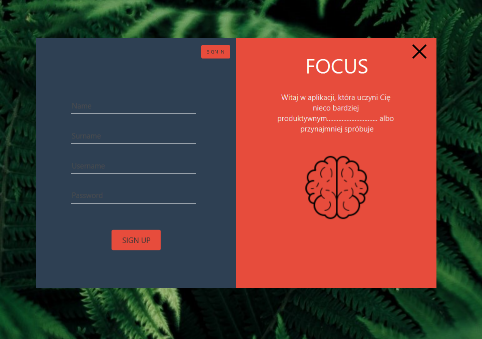
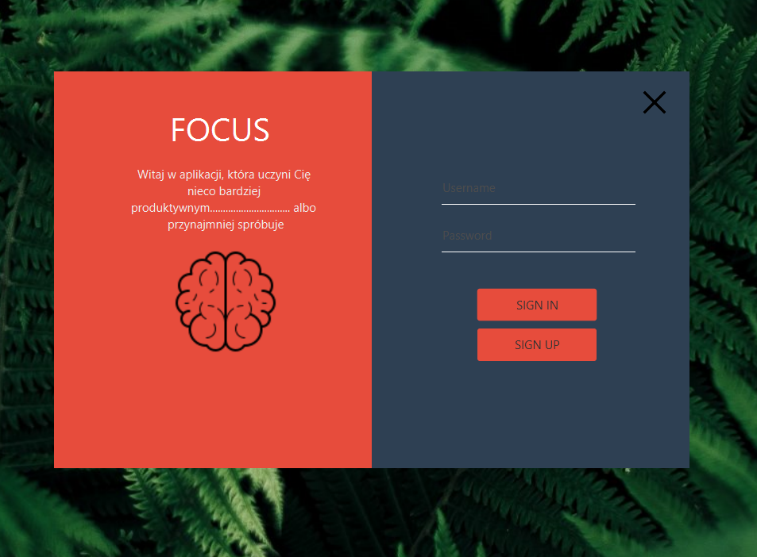
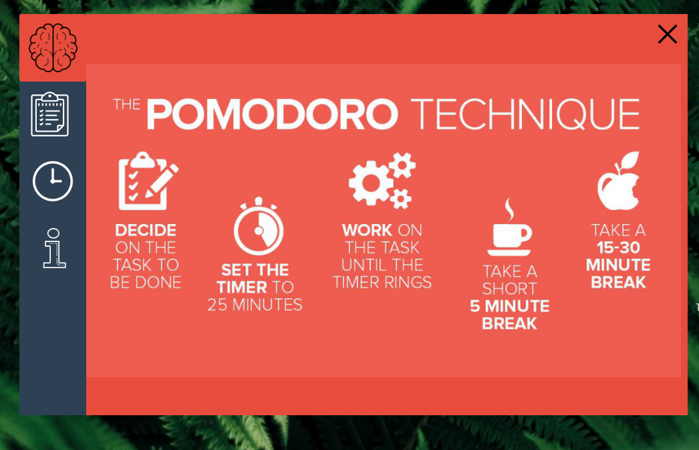
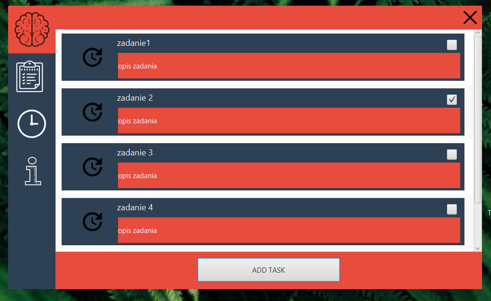

## Table of contents
* [General info](#general-info)
* [Technologies](#technologies)
* [Setup](#setup)

## General info
This project is simple to do list with pomodoro timer and database for your tasks. You can create your own account to save your to do list.
	

 
 
 
 

## Technologies
Project is created with:
* JavaFX
* SQL Database

	
## Setup
To run this project, you will need to create databse using file with database structure

